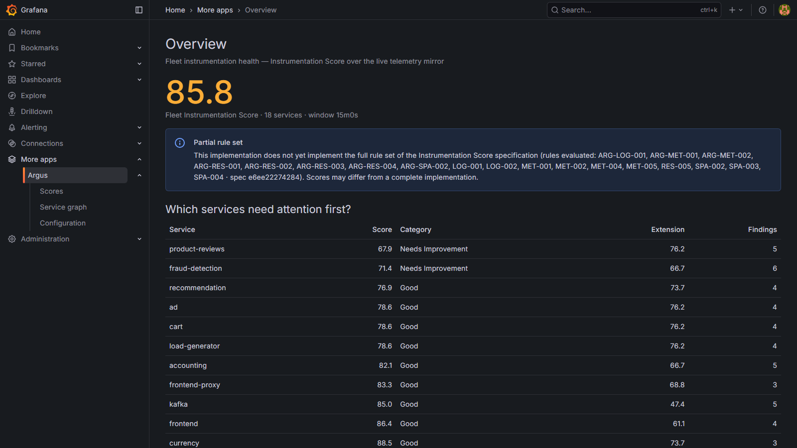
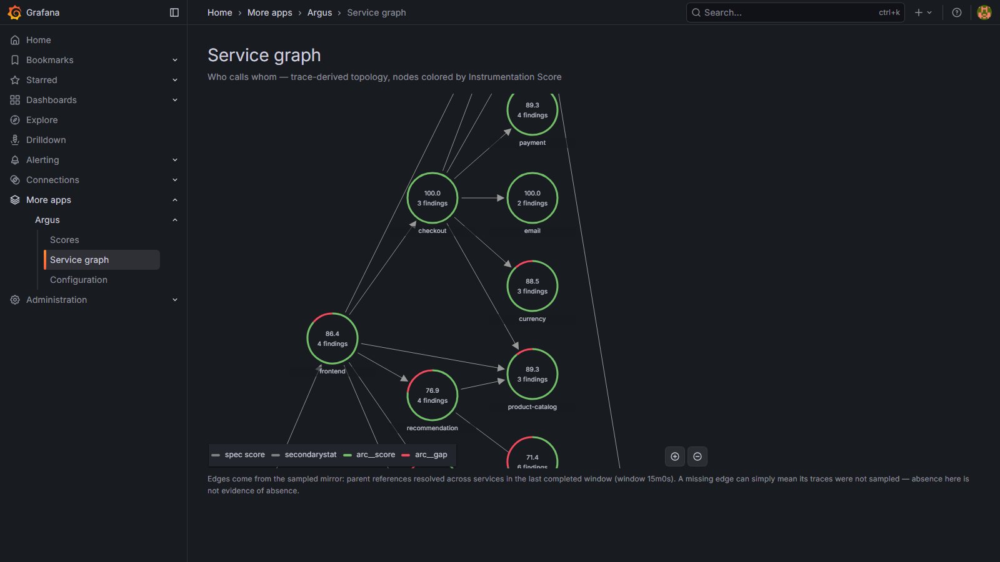
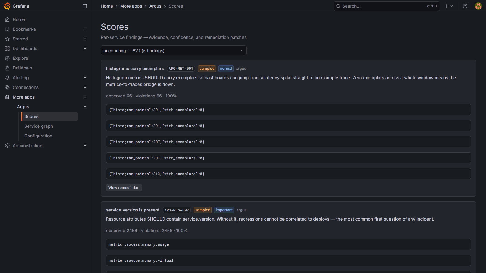
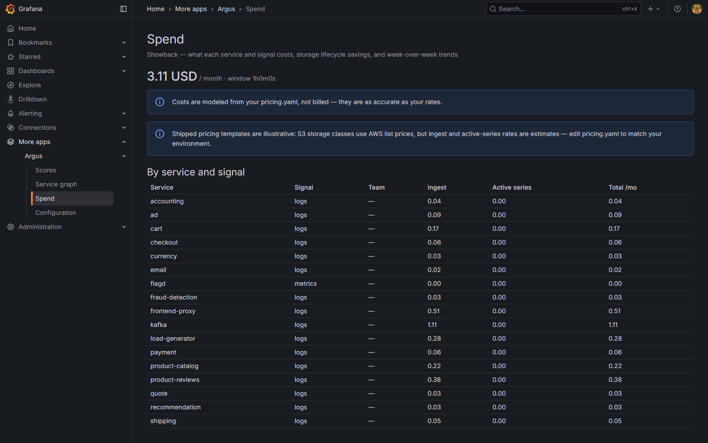

# Argus

**CI for reliability.** Argus scores your telemetry, prices it, backtests your alerts against
history, and proves — with an AI-agent benchmark — whether your observability can actually
diagnose an incident.

> Status: **Phase 1 — Score engine.** `argus score` (18 rules: 10 spec + 8 argus extensions),
> remediation templates, evidence-based threshold calibration, and the Grafana app
> (Overview / Scores / Service graph) run against a live LGTM stack. v0.1 tag pending final review.
> Roadmap and full specification: [docs/argus-master-build-plan.md](docs/argus-master-build-plan.md).

## What Argus will do

One Go engine, four capabilities, against a self-hosted Grafana LGTM stack
(Loki, Tempo, Mimir + Alloy/OTel Collector):

| Module | Verb | Question answered |
|---|---|---|
| **A1 — Score** | `argus score` | Is my instrumentation any good? |
| **A2 — Spend** | `argus cost` | What does each service/team/label cost in my LGTM stack? |
| **B — Backtest** | `argus backtest` | Would my alert rules have caught my past incidents, at what page load? |
| **C — Prove** | `argus bench` | Can an AI agent diagnose injected faults using my telemetry? |

Argus is an independent open-source **implementation of the
[Instrumentation Score specification](https://github.com/instrumentation-score/spec)**, an open
spec started by OllyGarden and community collaborators. Argus builds on that spec and on
OpenTelemetry semantic conventions (the same registry [OTel Weaver](https://github.com/open-telemetry/weaver)
validates at dev time) and extends them with cost attribution, alert backtesting, remediation
generation, and a live-environment agent benchmark that is scenario-compatible with
[ITBench](https://github.com/itbench-hub/ITBench).

## What it looks like

A quick tour — fleet overview, per-service findings with remediation, and Spend showback:


Live otel-demo fleet on the dev cluster — fleet Instrumentation Score with worst-first
triage, and a trace-derived service graph whose nodes are colored by each service's score:





Per-service findings carry evidence, a sampled/verified confidence badge, and a rendered
remediation patch (Alloy River + Collector YAML) behind a copy button:



Spend attributes the stack's modeled monthly cost by service and signal — showback for
self-hosted LGTM. The dollar figures come from *your* `pricing.yaml` rates; the shipped
templates are illustrative (S3 storage classes use AWS list prices, compute rates are
estimates to calibrate), and the page says so on every view:



## Repository layout

```
engine/      Go engine + argus CLI
plugin/      Grafana App Plugin (React + Scenes)
rules/       Built-in rule definitions (YAML + CEL)
scenarios/   Bench scenarios + fault manifests
deploy/      helm chart, kind bootstrap, terraform (EKS demo)
docs/        Documentation (mkdocs)
```

## Development

Dev environment is Linux (WSL2 Ubuntu 24.04 on Windows). Requires: Go ≥1.23, Node 22, Docker,
kind, kubectl, helm, make.

```bash
make dev-up    # kind cluster: LGTM stack + OpenTelemetry Demo + Chaos Mesh
make dev-down  # delete the cluster
make test      # unit tests, all modules
make lint      # golangci-lint + eslint
make build     # engine binary + plugin dist
make demo      # docker compose: engine + postgres + grafana + mini-LGTM
```

## License

[Apache-2.0](LICENSE)
